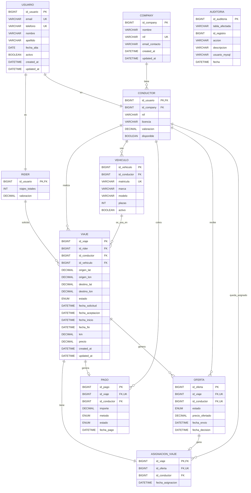

```mermaid
erDiagram

    COMPANY {
        BIGINT id_company PK
        VARCHAR nombre
        VARCHAR nif UK
        VARCHAR email_contacto
        DATETIME created_at
        DATETIME updated_at
    }

    USUARIO {
        BIGINT id_usuario PK
        VARCHAR email UK
        VARCHAR telefono UK
        VARCHAR nombre
        VARCHAR apellido
        DATE fecha_alta
        BOOLEAN activo
        DATETIME created_at
        DATETIME updated_at
    }

    RIDER {
        BIGINT id_usuario PK, FK
        INT viajes_totales
        DECIMAL valoracion
    }

    CONDUCTOR {
        BIGINT id_usuario PK, FK
        BIGINT id_company FK
        VARCHAR nif
        VARCHAR licencia
        DECIMAL valoracion
        BOOLEAN disponible
    }

    VEHICULO {
        BIGINT id_vehiculo PK
        BIGINT id_conductor FK
        VARCHAR matricula UK
        VARCHAR marca
        VARCHAR modelo
        INT plazas
        BOOLEAN activo
    }

    VIAJE {
        BIGINT id_viaje PK
        BIGINT id_rider FK
        BIGINT id_conductor FK
        BIGINT id_vehiculo FK
        DECIMAL origen_lat
        DECIMAL origen_lon
        DECIMAL destino_lat
        DECIMAL destino_lon
        ENUM estado
        DATETIME fecha_solicitud
        DATETIME fecha_aceptacion
        DATETIME fecha_inicio
        DATETIME fecha_fin
        DECIMAL km
        DECIMAL precio
        DATETIME created_at
        DATETIME updated_at
    }

    OFERTA {
        BIGINT id_oferta PK
        BIGINT id_viaje FK, UK
        BIGINT id_conductor FK, UK
        ENUM estado
        DECIMAL precio_ofertado
        DATETIME fecha_envio
        DATETIME fecha_decision
    }

    ASIGNACION_VIAJE {
        BIGINT id_viaje PK, FK
        BIGINT id_oferta FK, UK
        BIGINT id_conductor FK
        DATETIME fecha_asignacion
    }

    PAGO {
        BIGINT id_pago PK
        BIGINT id_viaje FK, UK
        BIGINT id_conductor FK
        DECIMAL importe
        ENUM metodo
        ENUM estado
        DATETIME fecha_pago
    }

    AUDITORIA {
        BIGINT id_auditoria PK
        VARCHAR tabla_afectada
        BIGINT id_registro
        VARCHAR accion
        VARCHAR descripcion
        VARCHAR usuario_mysql
        DATETIME fecha
    }

    USUARIO ||--|| RIDER : es
    USUARIO ||--|| CONDUCTOR : es

    COMPANY ||--o{ CONDUCTOR : tiene
    CONDUCTOR ||--o{ VEHICULO : usa
    RIDER ||--o{ VIAJE : solicita
    CONDUCTOR ||--o{ VIAJE : realiza
    VEHICULO ||--o{ VIAJE : se_usa_en
    VIAJE ||--o{ OFERTA : genera
    CONDUCTOR ||--o{ OFERTA : recibe
    VIAJE ||--|| ASIGNACION_VIAJE : tiene
    OFERTA ||--o| ASIGNACION_VIAJE : gana
    CONDUCTOR ||--o{ ASIGNACION_VIAJE : queda_asignado
    VIAJE ||--o| PAGO : genera
    CONDUCTOR ||--o{ PAGO : cobra
```