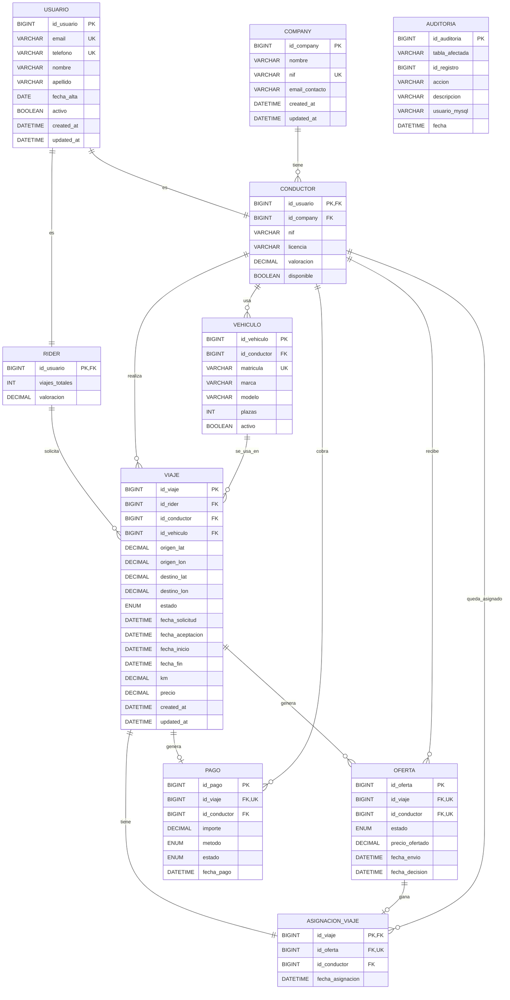

---

# Tablas y Relaciones

## Diagrama Conceptual del Flujo

El diseño implementa el flujo completo de un viaje en ride-hailing:

```
1. SOLICITUD    → Usuario (Rider) solicita viaje
2. OFERTA       → Sistema envía ofertas a múltiples Conductores
3. ACEPTACIÓN   → Primer Conductor que acepta gana el viaje
4. ASIGNACIÓN   → Viaje se asigna únicamente a ese Conductor
5. EJECUCIÓN    → Conductor realiza el viaje con su Vehículo
6. PAGO         → Sistema registra el pago al finalizar
7. AUDITORÍA    → Todos los cambios quedan registrados
```

---

## Descripción Detallada de Tablas

### **Tabla: company**

**Propósito:** Almacenar las compañías de transporte (Uber, Bolt, etc.)

| Campo | Tipo | Explicación |
|-------|------|-------------|
| `id_company` | BIGINT (PK) | Identificador único auto-incremental |
| `nombre` | VARCHAR(120) | Nombre de la compañía (ej: "Uber España") |
| `nif` | VARCHAR(20) (UK) | NIF único de la compañía para registro mercantil |
| `email_contacto` | VARCHAR(120) | Email para contacto administrativo |
| `created_at` | DATETIME | Timestamp de creación (para auditoría técnica) |
| `updated_at` | DATETIME | Timestamp de última actualización |

**Diseño:**
- Una compañía puede tener múltiples conductores (relación 1:N)
- El NIF es unique porque cada compañía tiene un NIF único en la administración

---

### **Tabla: usuario**

**Propósito:** Tabla base para TODOS los usuarios del sistema (Riders y Conductores)

**Diseño:** *Herencia de tabla única* (Single Table Inheritance)
- En lugar de duplicar datos en dos tablas separadas, se usa una tabla base `usuario`
- Cada usuario tiene un rol específico mediante las tablas `rider` y `conductor`

| Campo | Tipo | Explicación |
|-------|------|-------------|
| `id_usuario` | BIGINT (PK) | Identificador único auto-incremental |
| `email` | VARCHAR(120) (UK) | Email único para login y contacto |
| `telefono` | VARCHAR(20) (UK) | Teléfono único para verificación |
| `nombre` | VARCHAR(120) | Nombre del usuario |
| `apellido` | VARCHAR(120) | Apellido del usuario |
| `fecha_alta` | DATE | Fecha de registro en la plataforma |
| `activo` | BOOLEAN | Flag para soft-delete (usuario activo/inactivo) |
| `created_at` | DATETIME | Timestamp de creación |
| `updated_at` | DATETIME | Timestamp de última actualización |

**Ventajas de este diseño:**
- [OK] Datos comunes centralizados (email, teléfono, nombre)
- [OK] Facilita búsquedas y joins
- [OK] Previene duplicación de datos
- [OK] Permite que un usuario sea Rider y Conductor simultáneamente

---

### **Tabla: rider**

**Propósito:** Información específica de usuarios que solicitan viajes

| Campo | Tipo | Explicación |
|-------|------|-------------|
| `id_usuario` | BIGINT (PK, FK) | Referencia al usuario (relación 1:1) |
| `viajes_totales` | INT | Contador acumulado de viajes completados |
| `valoracion` | DECIMAL(3,2) | Puntuación de 0.00 a 5.00 |

**Diseño:**
- `viajes_totales` se mantiene como contador desnormalizado para evitar recalcular en cada consulta
- `valoracion` es calculada por riders (conductores valoran a riders)
- Foreign key con `ON DELETE CASCADE`: si se borra el usuario, se borra el rider

**Relaciones:**
- 1:N con `viaje` (un rider puede solicitar múltiples viajes)

---

### **Tabla: conductor**

**Propósito:** Información específica de usuarios que conducen

| Campo | Tipo | Explicación |
|-------|------|-------------|
| `id_usuario` | BIGINT (PK, FK) | Referencia al usuario (relación 1:1) |
| `id_company` | BIGINT (FK) | Compañía a la que pertenece |
| `nif` | VARCHAR(20) | NIF del conductor (documento de identidad) |
| `licencia` | VARCHAR(50) | Número de licencia de conducir |
| `valoracion` | DECIMAL(3,2) | Puntuación de 0.00 a 5.00 |
| `disponible` | BOOLEAN | Flag indicando si acepta viajes ahora |

**Diseño:**
- Foreign key a `company` con `ON DELETE RESTRICT`: no se puede borrar una compañía con conductores activos
- `disponible` permite que conductores se desconecten sin borrar el registro

**Relaciones:**
- N:1 con `company` (muchos conductores por compañía)
- 1:N con `vehiculo` (un conductor puede tener múltiples vehículos)
- 1:N con `viaje` (un conductor puede realizar múltiples viajes)
- 1:N con `oferta` (un conductor recibe múltiples ofertas)

---

### **Tabla: vehiculo**

**Propósito:** Vehículos registrados en el sistema

| Campo | Tipo | Explicación |
|-------|------|-------------|
| `id_vehiculo` | BIGINT (PK) | Identificador único auto-incremental |
| `id_conductor` | BIGINT (FK) | Conductor propietario/usuario del vehículo |
| `matricula` | VARCHAR(12) (UK) | Placa única del vehículo (ej: "1234-ABC") |
| `marca` | VARCHAR(50) | Marca del vehículo (Toyota, Hyundai, etc.) |
| `modelo` | VARCHAR(50) | Modelo del vehículo (Corolla, Ioniq, etc.) |
| `plazas` | INT | Número de plazas disponibles (1-8, constraint CHECK) |
| `activo` | BOOLEAN | Flag para vehículos disponibles/dados de baja |

**Diseño:**
- Relación 1:N con conductor (un conductor puede tener múltiples vehículos)
- Matrícula es única porque un vehículo real tiene una única placa
- Constraint CHECK asegura que plazas está entre 1 y 8

**Relaciones:**
- N:1 con `conductor` (muchos vehículos por conductor)
- 1:N con `viaje` (un vehículo puede realizar múltiples viajes)

---

### **Tabla: viaje**

**Propósito:** Registro de todos los viajes solicitados (el corazón de la plataforma)

| Campo | Tipo | Explicación |
|-------|------|-------------|
| `id_viaje` | BIGINT (PK) | Identificador único auto-incremental |
| `id_rider` | BIGINT (FK) | Usuario que solicita el viaje |
| `id_conductor` | BIGINT (FK, NULL) | Conductor asignado (null hasta aceptar oferta) |
| `id_vehiculo` | BIGINT (FK, NULL) | Vehículo usado (null hasta comenzar viaje) |
| `origen_lat` / `origen_lon` | DECIMAL(9,6) | Coordenadas GPS de salida |
| `destino_lat` / `destino_lon` | DECIMAL(9,6) | Coordenadas GPS de llegada |
| `estado` | ENUM | Estados posibles: 'solicitado', 'aceptado', 'en_curso', 'finalizado', 'cancelado' |
| `fecha_solicitud` | DATETIME | Cuándo se solicitó el viaje |
| `fecha_aceptacion` | DATETIME (NULL) | Cuándo se aceptó (null hasta aceptar) |
| `fecha_inicio` | DATETIME (NULL) | Cuándo comenzó (null hasta empezar) |
| `fecha_fin` | DATETIME (NULL) | Cuándo terminó (null si no finalizado) |
| `km` | DECIMAL(8,2) (NULL) | Distancia real en kilómetros |
| `precio` | DECIMAL(10,2) (NULL) | Precio final del viaje |
| `created_at` / `updated_at` | DATETIME | Auditoría técnica |

**Máquina de Estados:**
```
solicitado ──[oferta aceptada]──> aceptado ──[conductor inicia]──> en_curso ──[finaliza]──> finalizado
    ↓
    └─────────[rider cancela]──────> cancelado
```

**Diseño:**
- Campos `id_conductor`, `id_vehiculo`, `km`, `precio` son NULL hasta que se completa la etapa correspondiente
- Constraints CHECK aseguran que km y precio sean >= 0
- Relación N:1 con rider (muchos viajes por rider)
- Relación N:1 con conductor (muchos viajes por conductor)
- Relación N:1 con vehiculo (múltiples viajes por vehículo)

---

### **Tabla: oferta**

**Propósito:** Ofertas enviadas a conductores para un viaje específico

**Concepto clave:** Cuando un rider solicita un viaje, el sistema envía la oferta a múltiples conductores en paralelo. El **primer conductor que acepta gana el viaje**.

| Campo | Tipo | Explicación |
|-------|------|-------------|
| `id_oferta` | BIGINT (PK) | Identificador único auto-incremental |
| `id_viaje` | BIGINT (FK, UK*) | Viaje al que corresponde (* compuesto) |
| `id_conductor` | BIGINT (FK, UK*) | Conductor al que va dirigida (* compuesto) |
| `estado` | ENUM | 'pendiente', 'aceptada', 'rechazada', 'caducada' |
| `precio_ofertado` | DECIMAL(10,2) | Precio sugerido para este viaje |
| `fecha_envio` | DATETIME | Cuándo se envió la oferta |
| `fecha_decision` | DATETIME (NULL) | Cuándo se respondió (aceptó/rechazó) |

**Unique Constraint Compuesto:**
- `(id_viaje, id_conductor)` es único → **evita enviar dos ofertas del mismo viaje al mismo conductor**

**Estados de Oferta:**
- `pendiente` → Conductor no ha respondido aún
- `aceptada` → Conductor aceptó (ganó el viaje)
- `rechazada` → Conductor rechazó explícitamente
- `caducada` → Otro conductor aceptó primero, esta se marca como caducada automáticamente

**Relaciones:**
- N:1 con `viaje` (múltiples ofertas por viaje)
- N:1 con `conductor` (múltiples ofertas por conductor)

---

### **Tabla: asignacion_viaje** (Tabla de Asignación)

**Propósito:** Garantizar que EXACTAMENTE UN conductor es asignado por viaje

**Diseño avanzado:** Esta tabla implementa el patrón "primera aceptación gana"
- Utiliza transacción + `FOR UPDATE` para evitar race conditions
- Garantiza que si dos conductores aceptan simultáneamente, solo uno gana

| Campo | Tipo | Explicación |
|-------|------|-------------|
| `id_viaje` | BIGINT (PK, FK) | Viaje único (1:1) |
| `id_oferta` | BIGINT (FK, UK) | Oferta ganadora (cada oferta gana máximo una vez) |
| `id_conductor` | BIGINT (FK) | Conductor ganador (redundante pero facilita queries) |
| `fecha_asignacion` | DATETIME | Timestamp de cuándo se asignó |

**Por qué esta tabla:**
- Sin ella, tendríamos race conditions (dos conductores podrían aceptar el mismo viaje)
- La tabla fuerza la asignación única a nivel de base de datos

**Constraints:**
- PK en `id_viaje` → un viaje tiene exactamente una asignación (relación 1:1)
- UK en `id_oferta` → una oferta gana exactamente una asignación

---

### **Tabla: pago**

**Propósito:** Registro de pagos de viajes (trazabilidad financiera)

| Campo | Tipo | Explicación |
|-------|------|-------------|
| `id_pago` | BIGINT (PK) | Identificador único auto-incremental |
| `id_viaje` | BIGINT (FK, UK) | Viaje único (1:1, previene pagos duplicados) |
| `id_conductor` | BIGINT (FK) | Conductor que cobra |
| `importe` | DECIMAL(10,2) | Cantidad en euros pagada |
| `metodo` | ENUM | 'tarjeta' o 'efectivo' |
| `estado` | ENUM | 'pendiente', 'pagado', 'fallido' |
| `fecha_pago` | DATETIME (NULL) | Cuándo se procesó (null si pendiente) |

**Diseño:**
- UK en `id_viaje` → cada viaje tiene exactamente un pago
- Separated de `viaje` para independencia transaccional (viaje finaliza, pago se procesa después)

**Relaciones:**
- N:1 con `viaje` (múltiples viajes, cada uno un pago)
- N:1 con `conductor` (múltiples pagos por conductor)

---

### **Tabla: auditoria**

**Propósito:** Registro de TODOS los cambios en el sistema (compliance y debugging)

| Campo | Tipo | Explicación |
|-------|------|-------------|
| `id_auditoria` | BIGINT (PK) | Identificador único auto-incremental |
| `tabla_afectada` | VARCHAR(50) | Nombre de tabla modificada |
| `id_registro` | BIGINT | ID del registro afectado |
| `accion` | VARCHAR(20) | 'INSERT', 'UPDATE', 'DELETE' |
| `descripcion` | VARCHAR(255) | Descripción del cambio (ej: "Cambio de estado: solicitado -> aceptado") |
| `usuario_mysql` | VARCHAR(100) | Usuario de BD que hizo el cambio |
| `fecha` | DATETIME | Timestamp del cambio |

**Implementación:**
- Poblada automáticamente mediante **triggers** en tablas críticas
- Actualmente: triggers en `viaje` (cambios de estado) y `oferta` (nuevas ofertas)
- Permite reconstrucción completa del histórico

**Relaciones:**
- Genérica (no es FK, almacena histórico desacoplado)

---

## Relaciones Clave (Cardinalidad)

| Relación | Cardinalidad | Tipo de FK | Justificación |
|----------|--------------|-----------|---------------|
| COMPANY → CONDUCTOR | 1:N | RESTRICT en DELETE | Una compañía tiene múltiples conductores; no borrar compañías con conductores |
| USUARIO → RIDER | 1:1 | CASCADE en DELETE | Cada rider es un usuario; borrar usuario borra rider |
| USUARIO → CONDUCTOR | 1:1 | CASCADE en DELETE | Cada conductor es un usuario; borrar usuario borra conductor |
| CONDUCTOR → VEHICULO | 1:N | RESTRICT en DELETE | Un conductor tiene múltiples vehículos; no borrar conductores con vehículos |
| RIDER → VIAJE | 1:N | RESTRICT en DELETE | Un rider solicita múltiples viajes; no borrar riders activos |
| CONDUCTOR → VIAJE | 1:N | RESTRICT en DELETE | Un conductor realiza múltiples viajes; no borrar conductores activos |
| VEHICULO → VIAJE | 1:N | RESTRICT en DELETE | Un vehículo hace múltiples viajes; no borrar vehículos en uso |
| VIAJE → OFERTA | 1:N | RESTRICT en DELETE | Un viaje genera múltiples ofertas; no borrar viajes con ofertas |
| CONDUCTOR → OFERTA | 1:N | RESTRICT en DELETE | Un conductor recibe múltiples ofertas; no borrar conductores con ofertas |
| VIAJE → ASIGNACION_VIAJE | 1:1 | RESTRICT en DELETE | Cada viaje tiene exactamente una asignación |
| OFERTA → ASIGNACION_VIAJE | 1:1 | RESTRICT en DELETE | Cada oferta ganadora aparece una sola vez |
| VIAJE → PAGO | 1:1 | RESTRICT en DELETE | Cada viaje tiene exactamente un pago |
| CONDUCTOR → PAGO | 1:N | RESTRICT en DELETE | Un conductor recibe múltiples pagos |

---

## Decisiones de Diseño Justificadas

### **1. ¿Por qué herencia USUARIO → RIDER/CONDUCTOR?**

**Alternativas consideradas:**
- [NO] Tablas separadas: Duplicaría datos (email, teléfono, nombre)
- [NO] Tabla única con columnas: Muchos NULLs y confusión

**Solución elegida:** Single Table Inheritance
- [OK] Un rider puede ser conductor simultáneamente
- [OK] Datos comunes centralizados
- [OK] Búsquedas más simples

---

### **2. ¿Por qué tabla ASIGNACION_VIAJE?**

**Alternativa:** Asignar directamente en VIAJE
- [NO] No garantiza atomicidad en race conditions
- [NO] Difícil garantizar que una oferta gana exactamente una vez

**Solución elegida:** Tabla separada
- [OK] Tabla con PRIMARY KEY en viaje (1:1) = garantiza asignación única
- [OK] UK en oferta = garantiza que una oferta gana máximo una vez
- [OK] Transacción + FOR UPDATE = evita race conditions

---

### **3. ¿Por qué ENUM para estado de VIAJE?**

**Alternativa:** Tabla de Estados + FK
- [NO] Overkill para solo 5 estados
- [NO] Performance: JOIN innecesario

**Solución elegida:** ENUM
- [OK] Eficiente (almacenado como número, mostrado como texto)
- [OK] Constraint automático (no puede haber valores inválidos)
- [OK] Índices más efectivos

---

### **4. ¿Por qué DECIMAL(9,6) para coordenadas?**

**Alternativa:** POINT o GEOMETRY (spatial)
- [NO] Overkill sin queries GIS complejas
- [NO] Overhead de funciones espaciales

**Solución elegida:** DECIMAL(9,6)
- [OK] Precisión: 9 dígitos enteros, 6 decimales = resolución de ~0.1 metros
- [OK] Simple: se puede usar en cálculos normales
- [OK] Portable: funciona en cualquier BD

---

### **5. ¿Por qué NULL fields en VIAJE?**

Fields como `id_conductor`, `km`, `precio` son NULL inicialmente
- [OK] Refleja realidad: viaje no tiene conductor hasta que se acepta
- [OK] Constraints CHECK automáticos
- [OK] Auditoría clara (qué se rellenó y cuándo)

---

# Estrategia de Indexación

## Objetivos

La estrategia de indexación busca optimizar las queries más frecuentes en la plataforma:

1. **Búsquedas de viajes activos** por rider, conductor o estado
2. **Búsquedas de ofertas** por viaje, conductor o estado
3. **Filtros de auditoría** por fecha o tabla afectada
4. **Joins frecuentes** entre usuario, conductor y company
5. **Búsquedas de contacto único** (email, teléfono, matrícula, NIF)

Todos los índices se crean con la intención de reducir el número de escaneos de tabla completa (full table scans) y, por tanto, mejorar el rendimiento de consultas de lectura y escritura.

---

## Índices Detallados

### **TABLA: company**

#### `PRIMARY KEY (id_company)`
- **Columnas:** `id_company` (BIGINT, AUTO_INCREMENT)
- **Tipo:** Clustered Primary Key
- **Justificación:** Clave primaria obligatoria para identificar de forma única cada compañía.
- **Uso:** Todas las queries que referencian `c.id_company`, especialmente JOINs con tabla `conductor`.

#### `UNIQUE KEY uk_company_nif (nif)`
- **Columnas:** `nif` (VARCHAR)
- **Tipo:** Unique Index
- **Justificación:** El NIF de una compañía debe ser único en el sistema (constraint de negocio). Evita duplicados y acelera búsquedas de compañías por NIF.
- **Uso:** Validación de NIF único, búsquedas de compañía por NIF.

---

### **TABLA: usuario**

#### `PRIMARY KEY (id_usuario)`
- **Columnas:** `id_usuario` (BIGINT, AUTO_INCREMENT)
- **Tipo:** Clustered Primary Key
- **Justificación:** Identifica de forma única cada usuario en el sistema.
- **Uso:** Foreign key en tablas `rider`, `conductor` y referencias en `viaje`.

#### `UNIQUE KEY uk_usuario_email (email)`
- **Columnas:** `email` (VARCHAR)
- **Tipo:** Unique Index
- **Justificación:** El email debe ser único (constraint de negocio). Permite login y búsqueda rápida de usuario por email.
- **Uso:** Autenticación, búsquedas de usuario por email.

#### `UNIQUE KEY uk_usuario_telefono (telefono)`
- **Columnas:** `telefono` (VARCHAR)
- **Tipo:** Unique Index
- **Justificación:** El teléfono debe ser único (constraint de negocio). Acelera búsquedas por teléfono.
- **Uso:** Búsquedas de usuario por teléfono, validación de duplicados.

---

### **TABLA: vehiculo**

#### `PRIMARY KEY (id_vehiculo)`
- **Columnas:** `id_vehiculo` (BIGINT, AUTO_INCREMENT)
- **Tipo:** Clustered Primary Key
- **Justificación:** Identifica de forma única cada vehículo registrado.
- **Uso:** Foreign key en tabla `viaje`.

#### `UNIQUE KEY uk_vehiculo_matricula (matricula)`
- **Columnas:** `matricula` (VARCHAR)
- **Tipo:** Unique Index
- **Justificación:** La matrícula debe ser única. Permite identificar vehículos por placa (constraint de negocio).
- **Uso:** Búsquedas de vehículo por matrícula, validación de duplicados.

#### `KEY idx_vehiculo_conductor (id_conductor)`
- **Columnas:** `id_conductor` (BIGINT)
- **Tipo:** Non-Clustered Index
- **Justificación:** Se ejecutan queries frecuentes que buscan vehículos de un conductor específico:
  ```sql
  SELECT v.* FROM vehiculo v WHERE id_conductor = ? AND activo = TRUE
  ```
- **Uso:** Asignación de vehículos al viaje, consultas operativas de "vehículos del conductor".
- **Mejora:** Sin este índice, MySQL haría full table scan sobre todos los vehículos.

---

### **TABLA: viaje**

#### `PRIMARY KEY (id_viaje)`
- **Columnas:** `id_viaje` (BIGINT, AUTO_INCREMENT)
- **Tipo:** Clustered Primary Key
- **Justificación:** Identifica de forma única cada viaje solicitado.
- **Uso:** Foreign key en tablas `oferta`, `asignacion_viaje`, `pago`.

#### `KEY idx_viaje_rider (id_rider)`
- **Columnas:** `id_rider` (BIGINT)
- **Tipo:** Non-Clustered Index
- **Justificación:** Queries frecuentes que filtran viajes por rider:
  ```sql
  SELECT v.* FROM viaje v WHERE id_rider = ? ORDER BY fecha_solicitud DESC
  ```
- **Uso:** Historial de viajes del rider, dashboard del usuario.
- **Mejora:** Evita full table scan en una tabla que puede crecer a miles de filas.

#### `KEY idx_viaje_conductor (id_conductor)`
- **Columnas:** `id_conductor` (BIGINT)
- **Tipo:** Non-Clustered Index
- **Justificación:** Queries que traen viajes asignados a un conductor:
  ```sql
  SELECT v.* FROM viaje v WHERE id_conductor = ? AND estado = 'finalizado'
  ```
- **Uso:** Historial de viajes del conductor, estadísticas de ingresos.
- **Mejora:** Acelera el cálculo de métricas por conductor.

#### `KEY idx_viaje_estado_fecha (estado, fecha_solicitud)` **[COMPOSITE]**
- **Columnas:** `estado` (ENUM), `fecha_solicitud` (DATETIME)
- **Tipo:** Composite Non-Clustered Index
- **Justificación:** Esta es la query más crítica del dashboard de negocio:
  ```sql
  SELECT estado, COUNT(*) FROM viaje 
  WHERE estado = 'solicitado' AND fecha_solicitud >= DATE_SUB(NOW(), INTERVAL 1 DAY)
  GROUP BY estado
  ```
  Al ser un índice compuesto, MySQL puede usar ambas columnas para filtrar rápidamente.
- **Uso:** Dashboard de "viajes por estado", "viajes por hora", alertas de demanda en tiempo real.
- **Mejora:** Critical path - esta query se ejecuta cada minuto en el dashboard. Sin este índice sería lentísima.

---

### **TABLA: oferta**

#### `PRIMARY KEY (id_oferta)`
- **Columnas:** `id_oferta` (BIGINT, AUTO_INCREMENT)
- **Tipo:** Clustered Primary Key
- **Justificación:** Identifica de forma única cada oferta enviada a un conductor.
- **Uso:** Foreign key en tabla `asignacion_viaje`.

#### `UNIQUE KEY uk_oferta_viaje_conductor (id_viaje, id_conductor)` **[COMPOSITE]**
- **Columnas:** `id_viaje` (BIGINT), `id_conductor` (BIGINT)
- **Tipo:** Unique Composite Index
- **Justificación:** Garantiza que **no se envíe dos ofertas del mismo viaje al mismo conductor** (constraint de negocio crítico).
- **Uso:** Validación en procedimiento `sp_aceptar_oferta`.
- **Mejora:** Previene ofertas duplicadas y acelera búsquedas de "¿ya ofrecí este viaje a este conductor?"

#### `KEY idx_oferta_viaje_estado (id_viaje, estado)` **[COMPOSITE]**
- **Columnas:** `id_viaje` (BIGINT), `estado` (ENUM)
- **Tipo:** Composite Non-Clustered Index
- **Justificación:** Query muy frecuente dentro del procedimiento `sp_aceptar_oferta`:
  ```sql
  UPDATE oferta
  SET estado = 'caducada'
  WHERE id_viaje = ? AND estado = 'pendiente' AND id_oferta <> ?
  ```
  El índice compuesto permite localizar rápidamente todas las ofertas de un viaje que están pendientes.
- **Uso:** Procedimiento de aceptación de ofertas (marca como caducadas las ofertas perdidas).
- **Mejora:** Crítico para concurrencia - minimiza el tiempo que la transacción mantiene locks.

#### `KEY idx_oferta_conductor_estado (id_conductor, estado)` **[COMPOSITE]**
- **Columnas:** `id_conductor` (BIGINT), `estado` (ENUM)
- **Tipo:** Composite Non-Clustered Index
- **Justificación:** Dashboard de conductor necesita filtrar ofertas por estado:
  ```sql
  SELECT COUNT(*) FROM oferta 
  WHERE id_conductor = ? AND estado = 'aceptada'
  ```
- **Uso:** Cálculo de tasa de aceptación por conductor (`v_tasa_aceptacion_conductor`).
- **Mejora:** Vista agrupada que se consulta frecuentemente.

---

### **TABLA: asignacion_viaje**

#### `PRIMARY KEY (id_viaje)`
- **Columnas:** `id_viaje` (BIGINT)
- **Tipo:** Clustered Primary Key
- **Justificación:** Una tabla que garantiza una única asignación por viaje (relación 1:1). La clave primaria es el viaje.
- **Uso:** Búsqueda rápida de "¿quién ganó este viaje?"

#### `UNIQUE KEY uk_asignacion_oferta (id_oferta)`
- **Columnas:** `id_oferta` (BIGINT)
- **Tipo:** Unique Index
- **Justificación:** Garantiza que **una oferta solo puede ganar una vez** (constraint de negocio).
- **Uso:** Validación en procedimiento `sp_aceptar_oferta`.
- **Mejora:** Previene asignaciones duplicadas.

#### `KEY idx_asignacion_conductor (id_conductor)`
- **Columnas:** `id_conductor` (BIGINT)
- **Tipo:** Non-Clustered Index
- **Justificación:** Query para ver cuántos viajes ganó un conductor:
  ```sql
  SELECT COUNT(*) FROM asignacion_viaje WHERE id_conductor = ?
  ```
- **Uso:** Estadísticas de conductor.
- **Mejora:** Acelera agregaciones de negocio.

---

### **TABLA: pago**

#### `PRIMARY KEY (id_pago)`
- **Columnas:** `id_pago` (BIGINT, AUTO_INCREMENT)
- **Tipo:** Clustered Primary Key
- **Justificación:** Identifica de forma única cada pago registrado.
- **Uso:** Auditoría y trazabilidad de pagos.

#### `UNIQUE KEY uk_pago_viaje (id_viaje)`
- **Columnas:** `id_viaje` (BIGINT)
- **Tipo:** Unique Index
- **Justificación:** Garantiza que cada viaje tiene **un solo pago asociado** (constraint de negocio).
- **Uso:** Búsqueda rápida "¿cuál es el pago de este viaje?"
- **Mejora:** Previene pagos duplicados.

#### `KEY idx_pago_conductor (id_conductor)`
- **Columnas:** `id_conductor` (BIGINT)
- **Tipo:** Non-Clustered Index
- **Justificación:** Cálculo de ingresos por conductor:
  ```sql
  SELECT SUM(importe) FROM pago 
  WHERE id_conductor = ? AND estado = 'pagado'
  ```
- **Uso:** Vista `v_ingresos_conductor`, reportes financieros.
- **Mejora:** Acelera agregaciones en grandes volúmenes de pagos.

---

### **TABLA: auditoria**

#### `PRIMARY KEY (id_auditoria)`
- **Columnas:** `id_auditoria` (BIGINT, AUTO_INCREMENT)
- **Tipo:** Clustered Primary Key
- **Justificación:** Identifica de forma única cada registro de auditoría.
- **Uso:** Trazabilidad del sistema.

#### `KEY idx_auditoria_fecha (fecha)`
- **Columnas:** `fecha` (DATETIME)
- **Tipo:** Non-Clustered Index
- **Justificación:** Consultas frecuentes de auditoría filtrada por rango de fecha:
  ```sql
  SELECT * FROM auditoria 
  WHERE fecha >= DATE_SUB(NOW(), INTERVAL 7 DAY)
  ORDER BY fecha DESC
  ```
- **Uso:** Investigación de cambios recientes, cumplimiento normativo.
- **Mejora:** Evita full table scan en tabla de auditoría que crece constantemente.

#### `KEY idx_auditoria_tabla (tabla_afectada)`
- **Columnas:** `tabla_afectada` (VARCHAR)
- **Tipo:** Non-Clustered Index
- **Justificación:** Queries que filtran auditoría por tabla específica:
  ```sql
  SELECT * FROM auditoria WHERE tabla_afectada = 'viaje' ORDER BY fecha DESC
  ```
- **Uso:** Investigación de cambios en tabla específica.
- **Mejora:** Permite filtrado rápido por entidad auditada.

---

## Resumen de Índices

| Tabla | Tipo | Cantidad | Total MB (estimado) |
|-------|------|----------|---------------------|
| company | PK + UK | 2 | ~0.01 |
| usuario | PK + 2×UK | 3 | ~0.02 |
| vehiculo | PK + UK + IX | 3 | ~0.01 |
| viaje | PK + 3×IX | 4 | ~0.05 |
| oferta | PK + 2×UK + 2×IX | 5 | ~0.08 |
| asignacion_viaje | PK + 2×UK + IX | 4 | ~0.02 |
| pago | PK + UK + IX | 3 | ~0.02 |
| auditoria | PK + 2×IX | 3 | ~0.10 |
| **TOTAL** | | **27 índices** | **~0.31 MB** |

---

## Estrategia de Mantenimiento de Índices

### Monitorización
- Se pueden consultar estadísticas de índices con:
  ```sql
  SELECT object_schema, object_name, COUNT_READ, COUNT_WRITE
  FROM performance_schema.table_io_waits_summary_by_index_usage
  WHERE object_schema = 'ride_hailing'
  ORDER BY COUNT_READ DESC;
  ```

### Reconstrucción
- Índices fragmentados (fragmentación > 10%) deberían reconstruirse periódicamente:
  ```sql
  OPTIMIZE TABLE ride_hailing.viaje;
  OPTIMIZE TABLE ride_hailing.oferta;
  ```

### Índices Compuestos (Composite Indexes)
Los índices compuestos son especialmente potentes porque:
- `(estado, fecha_solicitud)` permite filtros rápidos en ambas columnas
- `(id_viaje, id_conductor)` previene inserciones duplicadas eficientemente
- `(id_viaje, estado)` acelera la actualización en cascada de ofertas caducadas